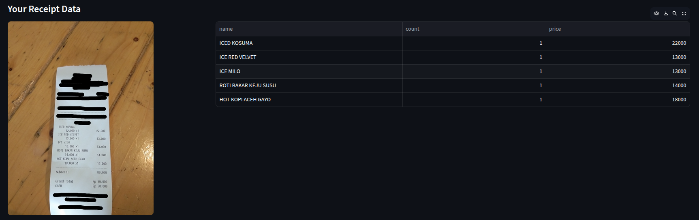
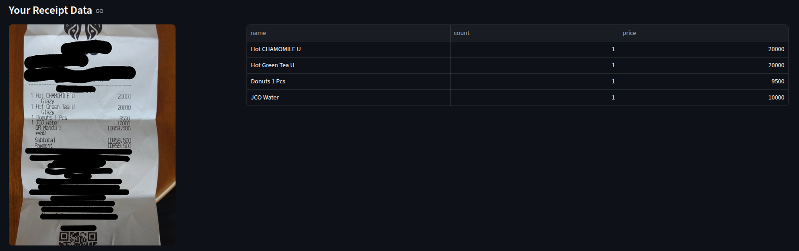

# OCR with Gemini Flash 2.5

## instalasi
- python 3.10++ 
- langchain

## Step
- Masukkan Google API Key ke file `.env.example`
- ubah nama `.env.example` menjadi `.env`
- jalankan `pip install -r requirement.txt`
- jalankan di cmd dengan command`streamlit run app.py`

## Hasil LLM OCR

## Hasil analisa
Penggunaan LLM gemini untuk OCR, mudah dioperasikan jika dibandingkan dengan menggunakan donut atau model OCR lainnya. Namun memiliki keterbasan token. Untuk keakuratan menggunakan model ini sangat baik untuk mendeteksi item, jumlah, dan harga.

<<by Mahindra>>

